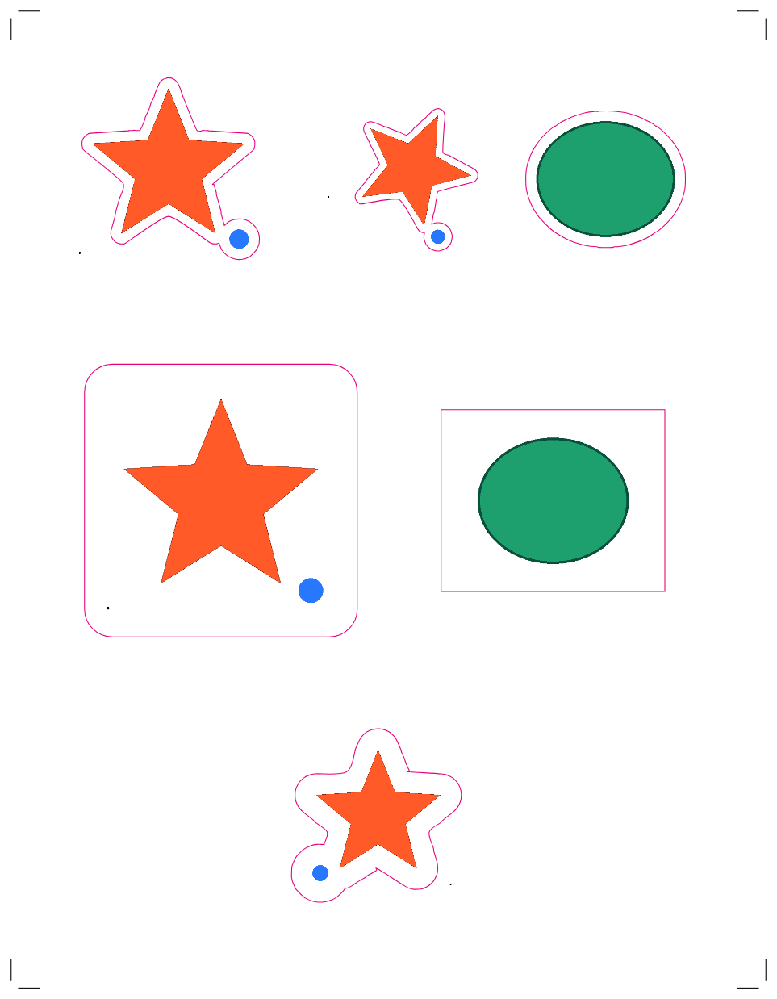

# Cutsheet

[](https://github.com/armeehn/cutsheet/actions/workflows/tests.yml)

Lay out images on a print sheet, set the bleed and margins, and generate cut
lines for a vinyl cutter. Everything runs in the browser — images never leave
the machine they were opened on.

Starts on **US Letter**. A4, Legal, Tabloid, A3/A5 and 12×12 / 12×24 cutting
mats are one dropdown away, plus any custom size.



## What it does

**Sheet setup**
- Page presets and custom sizes, portrait or landscape, in inches, mm, cm or points.
- Adjustable **sheet bleed** — the media grows beyond the trim so artwork can run off the edge.
- Adjustable **margins** (linked or per-side), drawn as a live-area guide.
- Machine profiles (generic, Cricut, Silhouette, Roland) seed sensible bleed, margin and registration-mark defaults.

**Placing artwork**
- Drop in PNG, JPEG, WebP, GIF or SVG — several at once, or paste from the clipboard.
- Move, scale from any corner or edge, rotate, and flip. Corners keep the aspect ratio; hold <kbd>Shift</kbd> to scale freely, <kbd>Alt</kbd> to scale from the centre.
- Snapping to the trim edge, the margins, the sheet centre and to other images, with guide lines. Hold <kbd>Alt</kbd> to bypass it.
- Align, distribute, auto-arrange, and "fill sheet with selection" for sticker sheets.
- Live checks: artwork off the sheet, cut lines crossing the margin, overlapping cut areas, and low effective DPI.

**Cut lines**
- **Contour** — traces the artwork's actual silhouette. Keys on transparency, or on a background colour sampled from the image for opaque files (JPEGs, scans).
- **Rectangle** — a box around the artwork, with an optional corner radius.
- Per-image **offset** (the sticker bleed), outward or inward, plus edge tolerance, corner smoothing, and a size threshold that ignores stray specks.
- Registration marks: crop marks, corner squares, Silhouette square-and-brackets, or the Cricut sensor border. The layout tools keep artwork clear of them.

**Output**
- Print file: PNG, JPEG or PDF at 150/300/600 DPI, with or without bleed and marks.
- Cut file: SVG at true size (1 unit = 1 mm) with paths on a layer named `CutContour`, either alongside the embedded artwork or on its own. DXF in millimetres for plotters and CAM.
- The PDF carries a `TrimBox` and vector cut paths in cut magenta.
- Projects save to a `.cutsheet.json` file, and the current sheet is restored automatically on your next visit (IndexedDB).

## Running it locally

Needs **Node 22 or newer** (see `.nvmrc`); Node 20 reached end of life in April
2026. The app itself is plain ES modules, HTML and CSS with no build step —
Node is only used for the dev server, the tests and deployment.

```sh
nvm use              # or: fnm use
npm ci
npm run dev          # serves ./public at http://localhost:5173
```

## Deploying to Cloudflare

The site is static, so it deploys as a Cloudflare Worker with static assets.

```sh
npx wrangler login          # one time, opens a browser
npx wrangler deploy         # -> https://cutsheet.<your-subdomain>.workers.dev
```

For CI or a headless machine, set `CLOUDFLARE_API_TOKEN` (Workers Scripts:Edit
permission) and `CLOUDFLARE_ACCOUNT_ID` instead of logging in.

To serve it from your own domain, add a route in `wrangler.toml`:

```toml
routes = [{ pattern = "cutsheet.example.com", custom_domain = true }]
```

`public/_headers` sets a strict Content-Security-Policy, `nosniff`, and a
no-referrer policy. There is no server code and no analytics.

## Tests

```sh
npm test             # 84 checks
```

CI runs them on Node 22 and 24 on every push and pull request, along with a
syntax check of every browser module and a credential-free
`wrangler deploy --dry-run` to catch a broken Cloudflare config.

- `tests/logic.test.mjs` — unit parsing, page geometry, undo history, the
  tracing algorithms, marks, layout tools and the SVG/DXF writers. Runs on
  plain Node.
- `tests/canvas.test.mjs` — contour tracing against real artwork, sheet
  rasterisation and the PNG/JPEG/PDF writers, using `@napi-rs/canvas` in place
  of the browser's `OffscreenCanvas`. Skips if that dev dependency is missing.
- `tests/project.test.mjs` — the `.cutsheet.json` round trip: saving a sheet,
  reopening it, and doing so without a network request (the deployed
  `connect-src 'self'` refuses the `data:` URLs a project file is made of).
- `tests/dom.test.mjs` — boots `public/index.html` in jsdom and drives the
  panels, checking the seam between the markup and the document model. jsdom
  has no layout engine and no canvas context, so it proves nothing about where
  anything is *drawn*; use the two below for that.
- `tests/preview.mjs` — renders a demo sheet to PNG so cut paths can be
  eyeballed: `node tests/preview.mjs docs`.
- `tests/browser-render.html` — open it through a local server to confirm the
  on-screen renderer works in a real browser.

## How contour tracing works

`public/js/trace.js`, in order:

1. Draw the artwork into a padded working buffer sized so one pixel is square in millimetres.
2. Build a binary mask, keying on alpha or on the background colour sampled from the artwork's corners.
3. Drop blobs below the size threshold — done *before* offsetting, so a large offset cannot inflate a speck back into a cut path.
4. Grow (or shrink) the mask by the offset using an exact Euclidean distance transform.
5. Label the remaining blobs and walk each boundary with Moore-neighbour tracing.
6. Simplify each ring with Ramer–Douglas–Peucker, split at its farthest point so the ring is not measured against a zero-length baseline.
7. Convert to closed cubic béziers with Catmull–Rom smoothing.

The result is cached per image and per cut setting, and retraced lazily on idle.

## Keyboard

| | |
|---|---|
| <kbd>I</kbd> | Add images |
| <kbd>Ctrl</kbd>+<kbd>S</kbd> / <kbd>E</kbd> | Save project / Export |
| <kbd>Ctrl</kbd>+<kbd>Z</kbd> | Undo (<kbd>Shift</kbd> to redo) |
| <kbd>Ctrl</kbd>+<kbd>D</kbd> / <kbd>A</kbd> | Duplicate / select all |
| <kbd>Delete</kbd> | Remove selection |
| Arrows | Nudge (<kbd>Shift</kbd> for 10×) |
| <kbd>Space</kbd>+drag | Pan · <kbd>Ctrl</kbd>+wheel to zoom |
| <kbd>Ctrl</kbd>+<kbd>0</kbd> | Fit sheet to window |
